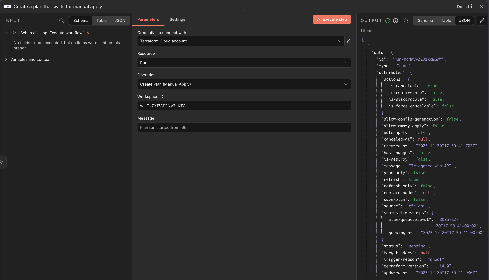
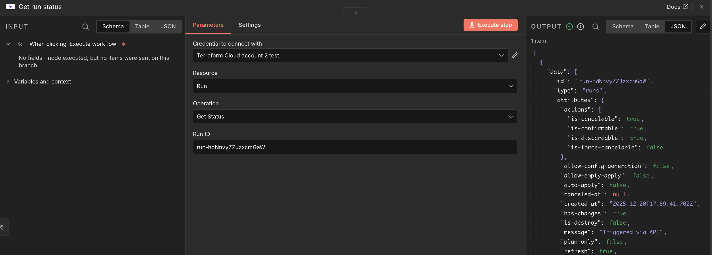
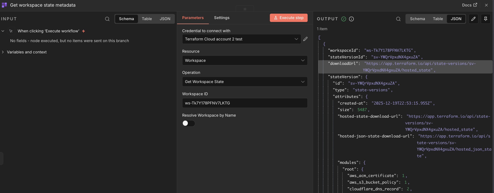
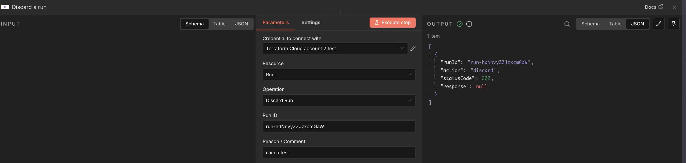

# n8n Terraform Cloud Nodes

Custom n8n nodes to work with HashiCorp Terraform Cloud: manage runs, workspaces, projects, and state metadata.

## Nodes included
- **TerraformCloud**: Run operations (create plan/manual apply, apply, cancel, discard, add comment), list runs by workspace, get run status, list projects, list workspaces, fetch latest workspace state metadata.

## What you can do (quick overview)
### Runs
- Create plan-only runs or plans that wait for manual apply in a workspace.
- Apply, cancel, or discard an existing run.
- Add comments to a run.
- List runs per workspace or fetch the status of a specific run.

### Workspaces
- List workspaces in an organization.
- Fetch workspace details (includes current/latest run).
- Fetch the current workspace state (state version + download URL).

### Projects
- List projects in an organization.

## Credentials
You will need an api token credential to interact with Terraform Cloud.

## Example flows

### General Overview


### Launch a plan and check its status
1) TerraformCloud node → Resource `Run` → Operation `Create Plan (Manual Apply)` → set Workspace ID + message.  


2) TerraformCloud node → Resource `Run` → Operation `Get Status` → use the `runId` from step 1.  
(Place your screenshot of the n8n flow here.)


### Fetch workspace tf state
1) TerraformCloud node → Resource `Workspace` → Operation `Get Workspace State`.  
2) Provide `workspaceId` or enable `Resolve Workspace by Name` with `stateOrganization` + `workspaceName`.  


### Discard a Run from a Workspace
1) TerraformCloud node → Resource `Run` → Operation `Discard a run`. 



## Requirements
- Terraform Cloud API token with access to the target organization/workspaces.
- n8n 1.0+ (tested on 2.0.3).

## Quick start
```bash
npm install
npm run dev   # starts n8n with the custom nodes linked
```

### Build and lint
```bash
npm run build
npm run lint
```

